<div align="center">

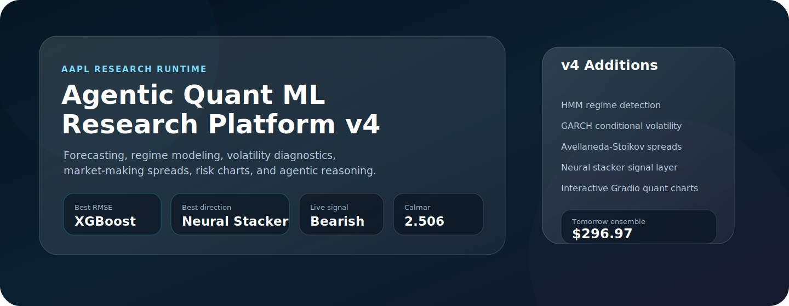

<br>


</div>

## Abstract

This repository is an end-to-end agentic quant research notebook for AAPL (Apple INC.) & Other NASDAQ, NSE and BSE of India listed stocks . The latest version expands the earlier stock-prediction pipeline into a broader research cockpit: machine-learning forecasts, neural signal stacking, HMM regime detection, GARCH volatility modeling, Avellaneda-Stoikov spread estimation, walk-forward drift checks, residual diagnostics, portfolio risk analytics, and a Gradio dashboard with interactive quant charts.

The goal is not to pretend that daily stock returns are easy to predict.Because ofcourse they are not. The goal is to build a transparent research workflow where every prediction is surrounded by validation, uncertainty, explanation, risk, and agentic reasoning.

> This is an educational research project. Not financial advice.

## Runtime Snapshot

| Field | Value |
|---|---:|
| Ticker | AAPL |
| Runtime date | 2026-06-22 |
| Test observations | 537 |
| Test window | 2024-04-26 to 2026-06-17 |
| Best RMSE model | XGBoost |
| Best RMSE | 0.017655 |
| Best directional model | Neural Stacker |
| Best directional accuracy | 55.37% |
| Live price | $298.01 |
| Ensemble forecast | $296.97 |
| Sentiment-adjusted forecast | $297.03 |
| Signal | BEARISH |
| Prediction date | 2026-06-23 |

## Architecture

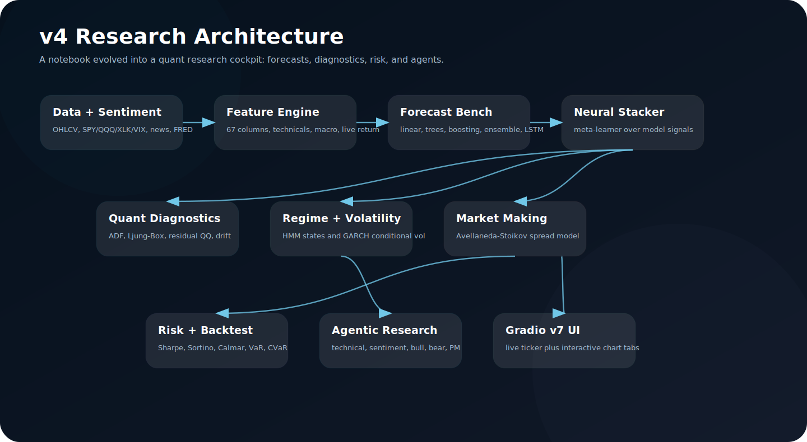

The notebook is organized as a layered system:

| Layer | What It Adds |
|---|---|
| Data and sentiment | AAPL OHLCV, SPY/QQQ/XLK/VIX context, Finnhub live quotes, FRED macro fields, news sentiment. |
| Feature engineering | 67-column feature frame with trend, volatility, volume, lag, macro, calendar, and live-injected features. |
| Forecast bench | Linear regression, ridge, XGBoost, LightGBM, random forest, weighted ensemble, LSTM. |
| Neural stacker | Learns from base model signals and becomes the best directional model in this run. |
| Quant diagnostics | ADF stationarity, Ljung-Box residual autocorrelation, QQ/fat-tail diagnostics, walk-forward drift. |
| Regime and volatility | HMM bull/bear regimes plus GARCH(1,1) conditional volatility. |
| Market-making model | Avellaneda-Stoikov reservation price and spread model as a risk/liquidity lens. |
| Risk layer | Strategy vs buy-and-hold comparison using Sharpe, Sortino, Calmar, VaR, CVaR, drawdown, and tail metrics. |
| Agentic workflow | Technical, sentiment, bull, bear, and portfolio-manager agents turn metrics into a decision narrative. |
| Gradio dashboard | Live ticker card, forecast output, NSE watchlist, and interactive quant chart tabs. |

## Asset Pack

Attach the full `assets/` folder with this README. The important files are:

| Asset | Use In The README |
|---|---|
| `model_comparison.png` | Static model benchmark across RMSE, MAPE, and direction accuracy. |
| `shap_summary.png` | Bar-style global SHAP importance for the XGBoost model. |
| `shap_beeswarm.png` | Distribution-level SHAP view, useful for direction and spread of feature effects. |
| `stationarity_diagnostics.png` | ADF, autocorrelation, and stationarity diagnostics for return modeling assumptions. |
| `hmm_regime_garch.png` | HMM bull/bear regime overlay with GARCH conditional volatility. |
| `lstm_training_curve.png` | Neural training and validation curve showing the LSTM overfit point. |
| `walkforward_drift.png` | Rolling walk-forward RMSE and directional-accuracy drift. |
| `residual_distribution.png` | Residual histogram and QQ-style diagnostics for fat-tail behavior. |
| `quant_risk_charts.png` | Risk dashboard for drawdown, VaR/CVaR, returns, and model weights. |
| `backtest_Ensemble.html` | Interactive Plotly backtest equity and trade visualization. |
| `multistep_forecast.html` | Interactive T+1/T+3/T+5/T+10 forecast horizon view. |
| `avellaneda_stoikov_spread.html` | Interactive market-making spread chart from the Avellaneda-Stoikov model. |

## Gradio Chart Additions

The new Gradio dashboard is no longer just a forecast card. It now behaves like a compact quant cockpit with chart tabs. These are the assets I would attach and highlight:

| Dashboard Chart | Asset | Why It Matters |
|---|---|---|
| Model comparison | `assets/model_comparison.png` | Shows how different model families trade off RMSE, MAPE, and directional accuracy. |
| Accuracy dashboard | generated in notebook UI | Tracks RMSE, MAE, R2, direction accuracy confidence intervals, IC, and DM-style forecast comparison. |
| Walk-forward drift | `assets/walkforward_drift.png` | Checks whether model performance decays across rolling validation windows. |
| HMM + GARCH | `assets/hmm_regime_garch.png` | Separates market regimes and volatility states instead of assuming one stable data-generating process. |
| Residual diagnostics | `assets/residual_distribution.png` | Shows bias, skew, fat tails, and normality issues in prediction errors. |
| Multi-step forecast | `assets/multistep_forecast.html` | Interactive horizon chart showing error growth from T+1 to T+10. |
| Backtest | `assets/backtest_Ensemble.html` | Interactive equity and strategy behavior view. |
| Quant risk | `assets/quant_risk_charts.png` | Drawdown, VaR/CVaR, strategy-vs-benchmark risk, and model weights. |
| Avellaneda-Stoikov spread | `assets/avellaneda_stoikov_spread.html` | Liquidity-aware market-making spread estimate based on risk aversion and volatility. |
| SHAP | `assets/shap_summary.png`, `assets/shap_beeswarm.png` | Feature attribution for the XGBoost model. |
| LSTM training | `assets/lstm_training_curve.png` | Shows where the sequence model starts overfitting. |

## Model Benchmark

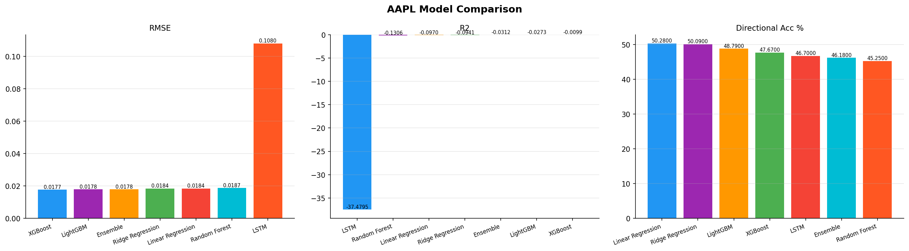

| Model | RMSE | MAE | R2 | Direction Acc | Direction CI | IC |
|---|---:|---:|---:|---:|---:|---:|
| Linear Regression | 0.018400 | 0.013291 | -0.0970 | 50.28% | [46.1,54.5] | 0.0419 |
| Ridge Regression | 0.018376 | 0.013252 | -0.0941 | 50.09% | [45.9,54.3] | 0.0433 |
| XGBoost | 0.017655 | 0.011899 | -0.0099 | 47.67% | [43.5,51.9] | -0.0327 |
| LightGBM | 0.017807 | 0.012322 | -0.0273 | 48.79% | [44.6,53.0] | 0.0413 |
| Random Forest | 0.018680 | 0.013322 | -0.1306 | 45.25% | [41.1,49.5] | 0.0977 |
| Ensemble | 0.017841 | 0.012334 | -0.0312 | 46.18% | [42.0,50.4] | 0.0550 |
| LSTM | 0.108005 | 0.079507 | -37.4795 | 46.70% | [42.5,51.0] | -0.0413 |
| Neural Stacker | 0.018917 | 0.013043 | -0.1805 | 55.37% | [51.1,59.5] | -0.0421 |

The result is more interesting than a simple leaderboard:

1. XGBoost gives the best magnitude forecast with RMSE `0.017655`.
2. Neural Stacker gives the best directional accuracy at `55.37%`.
3. Random Forest has the best positive Spearman IC at `0.0977`, even though it is not the best RMSE model.
4. LSTM remains weak as a magnitude model, with RMSE `0.108005` and strongly negative R2.
5. MAPE is reported in the artifact, but it should not be treated as the main metric because the target is log return and can be close to zero.

## Neural Stacker

The Neural Stacker is the most important new modeling addition. Instead of treating each model independently, it learns over base model signals from tree models and the LSTM-aligned signal set.

| Stacker Metric | Value |
|---|---:|
| RMSE | 0.018917 |
| MAE | 0.013043 |
| Direction accuracy | 55.37% |
| Direction CI | [51.1,59.5] |
| R2 | -0.1805 |

This is a nice research result because the stacker improves direction but not magnitude. That means it may be more useful as a trade filter than as a raw price forecaster.

## Forecast Artifact

From `tomorrow_prediction.json`:

```json
{
  "ticker": "AAPL",
  "live_price": 298.01,
  "xgboost": 297.5,
  "lightgbm": 297.03,
  "random_forest": 296.33,
  "ensemble": 296.97,
  "ensemble_sentiment_adjusted": 297.03,
  "sentiment_score": 0.1306,
  "pct_change": -0.35,
  "prediction_date": "2026-06-23",
  "live_injected": true,
  "market_state": "REGULAR"
}
```

The model stack gave a bearish short-term read:

| Model | Forecast |
|---|---:|
| XGBoost | $297.50 |
| LightGBM | $297.03 |
| Random Forest | $296.33 |
| Ensemble | $296.97 |
| Sentiment-adjusted ensemble | $297.03 |

## Sentiment Layer

| Sentiment Field | Value |
|---|---:|
| News sentiment | 0.1290 |
| Alternative news sentiment | 0.1322 |
| Combined sentiment | 0.1306 |
| Analyst score | 0.0000 |
| Yahoo article count | 19 |
| Alternative article count | 50 |

The sentiment score is mildly positive, but the final ensemble signal is still bearish. That conflict is useful because it gives the agent layer something real to reason about instead of forcing a one-note conclusion.

## Regime And Volatility Modeling

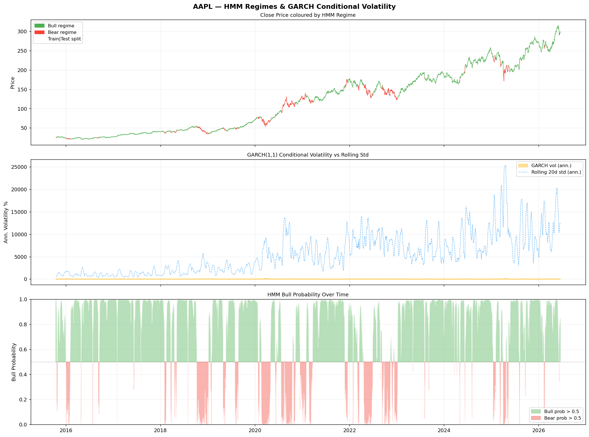

The notebook adds two serious quant diagnostics:

| Method | What It Tests |
|---|---|
| Hidden Markov Model | Whether returns look like they come from different hidden regimes, such as bull and bear states. |
| GARCH(1,1) | Whether volatility clusters and persists through time. |

Notebook output reported:

| Regime / Volatility Metric | Value |
|---|---:|
| Bull-state mean return | +0.00157 |
| Bear-state mean return | -0.00098 |
| Test-set bull regime share | 89.6% |
| Test-set bear regime share | 10.4% |
| GARCH persistence alpha + beta | 0.9860 |
| Average annualized GARCH volatility | 27.1% |
| GARCH volatility range | 15.4% to 94.1% |

The GARCH persistence being close to 1.0 is exactly the kind of behavior finance people expect from volatility: shocks do not disappear instantly.

## Stationarity And Residual Diagnostics

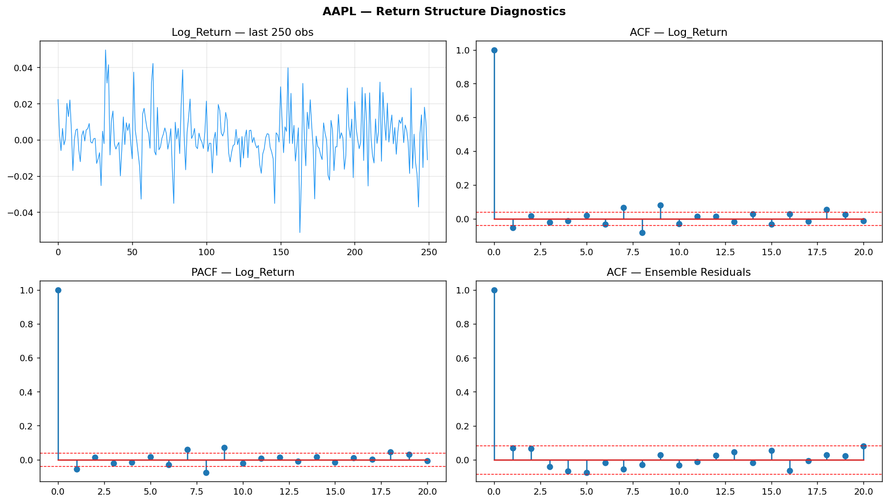

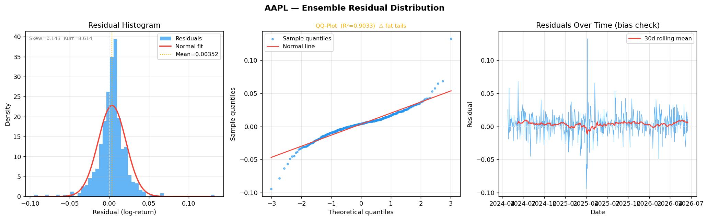

| Diagnostic | Result |
|---|---:|
| ADF statistic on log returns | -16.8033 |
| ADF p-value | 0.000000 |
| Ljung-Box p-value at lag 5 | 0.0350 |
| Ljung-Box p-value at lag 10 | 0.1206 |
| Residual mean | 0.003600 |
| Residual std | 0.017482 |
| Residual skew | 0.1589 |
| Residual excess kurtosis | 8.5535 |

The good part: log returns look stationary by ADF. The uncomfortable part: residuals still show fat tails and non-zero bias. That is not a failure of the README. That is the kind of honest diagnostic a research project should show.

## Walk-Forward Validation

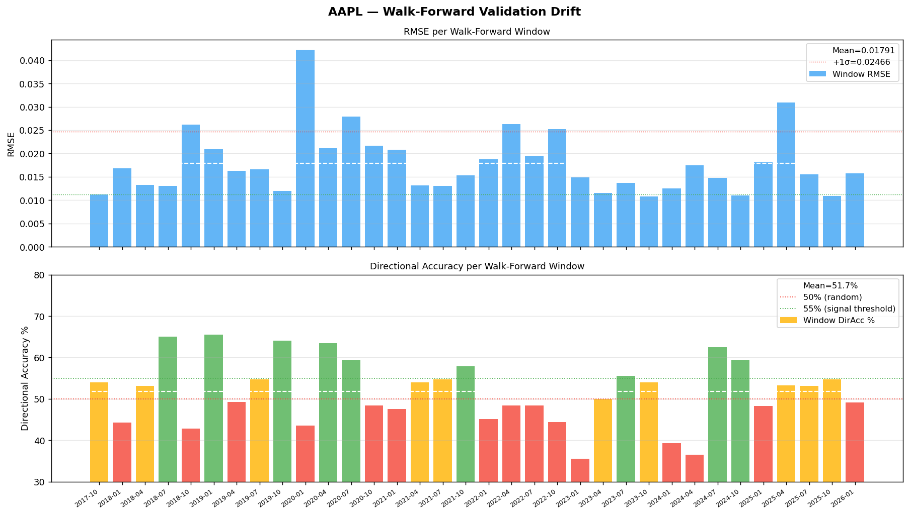

| Walk-Forward Metric | Value |
|---|---:|
| Windows | 34 |
| Mean RMSE | 0.017913 |
| RMSE std | 0.006853 |
| Mean directional accuracy | 51.7% |
| Directional accuracy range | 35.5% to 65.6% |
| Directional trend slope | -0.137% per window |

The drift chart is important because one train-test split can be lucky. Walk-forward validation asks the harder question: does the model keep behaving when the market regime changes?

## Multi-Step Forecasting

Interactive chart: [`assets/multistep_forecast.html`](assets/multistep_forecast.html)

| Horizon | RMSE log-return | RMSE price |
|---:|---:|---:|
| T+1 | 0.017668 | $3.939 |
| T+3 | 0.033279 | $7.448 |
| T+5 | 0.043337 | $9.780 |
| T+10 | 0.060362 | $13.874 |

Error grows with horizon, which is exactly what I would expect. The notebook is strongest as a short-horizon research engine, not as a long-range price oracle.

## Explainability

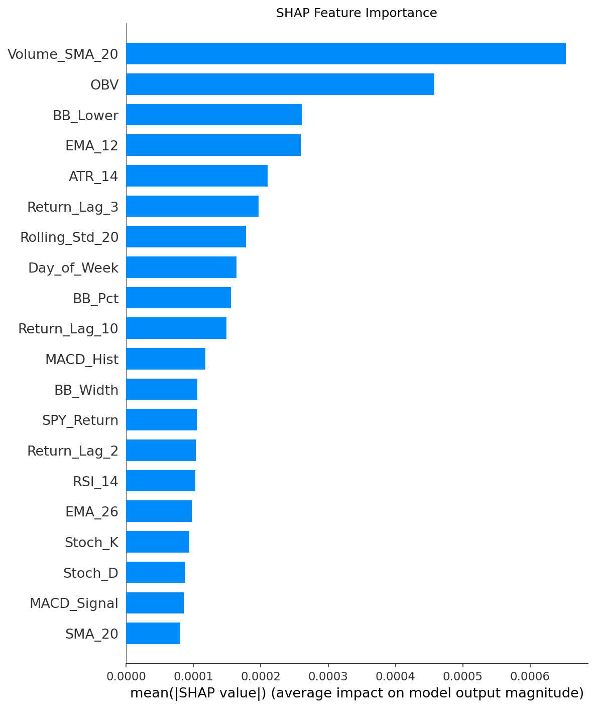

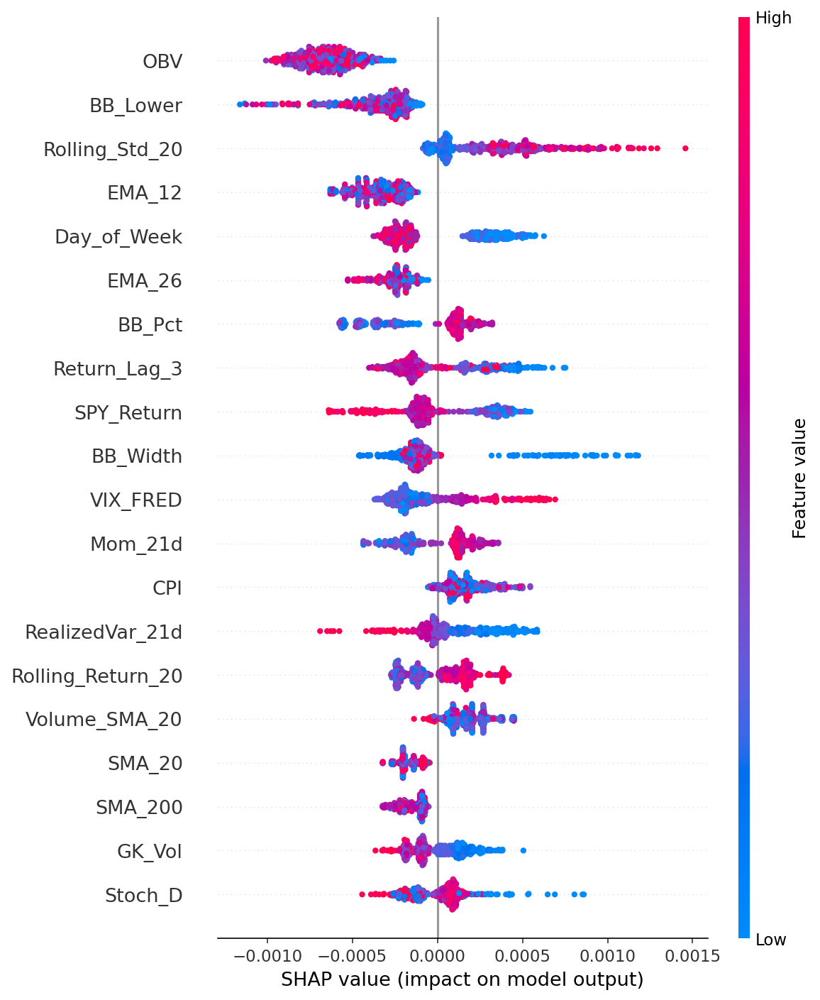

The README should include both SHAP views:

| SHAP View | Why It Exists |
|---|---|
| Bar summary | Gives the clean feature importance ranking. |
| Beeswarm | Shows whether high/low feature values push predictions up or down across observations. |

This keeps the model from being a black box. It does not prove causality, but it makes the learned signal inspectable.

## LSTM Training Curve

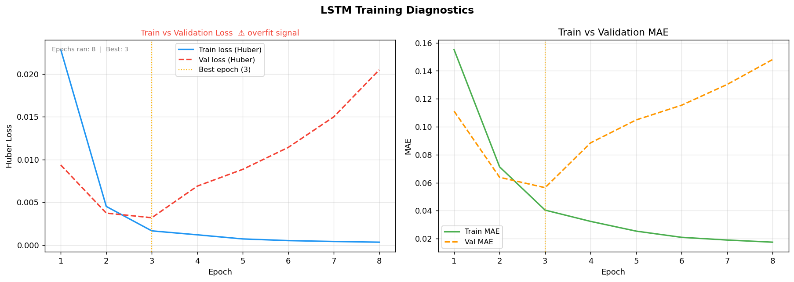

The LSTM is included as a serious experiment, not as a victory lap.

| LSTM Finding | Value |
|---|---:|
| Best validation loss epoch | 3 |
| Final train/validation gap | +0.020618 |
| Test RMSE | 0.108005 |
| Direction accuracy | 46.70% |

The curve shows overfitting. 

## Backtest And Risk Layer

Interactive backtest: [`assets/backtest_Ensemble.html`](assets/backtest_Ensemble.html)

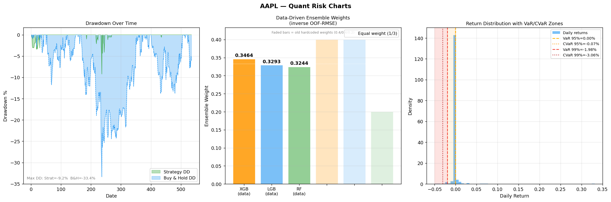

| Metric | Ensemble Strategy | Buy and Hold |
|---|---:|---:|
| Ann Return % | 23.08 | 34.35 |
| Ann Vol % | 25.31 | 28.08 |
| Sharpe | 0.912 | 1.223 |
| Sortino | 0.784 | 1.235 |
| Calmar | 2.506 | 1.03 |
| VaR 95% (1d) | 0.0 | -2.672 |
| CVaR 95% (1d) | -0.07 | -3.918 |
| Max DD % | -9.21 | -33.36 |
| Tail Ratio | 18710839.35 | 0.977 |

The strategy did not beat buy-and-hold on annual return or Sharpe in this artifact, but it did reduce max drawdown sharply:

| Comparison | Result |
|---|---:|
| Strategy annual return | 23.08% |
| Buy-and-hold annual return | 34.35% |
| Strategy max drawdown | -9.21% |
| Buy-and-hold max drawdown | -33.36% |
| Strategy Calmar | 2.506 |
| Buy-and-hold Calmar | 1.03 |

That is the real trade-off: less return, but much better drawdown control.

## Avellaneda-Stoikov Spread Model

Interactive chart: [`assets/avellaneda_stoikov_spread.html`](assets/avellaneda_stoikov_spread.html)

| Market-Making Metric | Value |
|---|---:|
| Risk aversion gamma | 0.1 |
| Kappa | 1.5 |
| Average half-spread | 3.0193 |
| Average full spread | 6.0385 |
| Average full spread percent | 2.5589% |
| Reservation offset from mid | -0.6862 |
| Spread range | 3.5257 to 28.3183 |

I would frame this as a liquidity and uncertainty lens. If the predicted move is smaller than the estimated spread, the forecast may not be tradeable after costs and adverse selection.

## Agentic Research Layer

The LangGraph workflow turns structured signals into a debate:

| Agent | Role |
|---|---|
| Technical analyst | Reads price forecast, SHAP drivers, and technical evidence. |
| Sentiment analyst | Reads FinBERT/news/macro sentiment. |
| Bull researcher | Builds the strongest upside case. |
| Bear researcher | Builds the strongest downside case. |
| Portfolio manager | Produces a final decision and position rationale. |

The important improvement is not that the agent always agrees with the model. The improvement is that it is forced to reason over uncertainty, conflicting evidence, and risk metrics.

## Main Findings

| Finding | Interpretation |
|---|---|
| XGBoost remains the best RMSE model | Gradient boosting is still the strongest magnitude forecaster here. |
| Neural Stacker wins direction | The meta-layer is useful as a signal filter, even if RMSE is worse than XGBoost. |
| HMM/GARCH improves market context | Regime and volatility modeling make the forecast environment more interpretable. |
| Residuals are fat-tailed | Normal-error assumptions are dangerous for this data. |
| LSTM overfits | Sequence modeling did not beat simpler models in this setup. |
| Risk improved, return did not | The strategy reduced drawdown but did not beat buy-and-hold on return or Sharpe. |
| Gradio is a real cockpit | The app now surfaces diagnostics, not just a prediction. |

## Limitations

1. AAPL-only results should not be treated as universal market evidence.
2. Directional accuracy is improved by the Neural Stacker, but 55.37% is still a weak edge.
3. MAPE is not reliable for log-return targets and should be de-emphasized.
4. LSTM overfits and should be treated as an experimental baseline.
5. The strategy reduces drawdown, but buy-and-hold still wins on annual return and Sharpe.
6. The agentic layer can make fluent arguments, so it must remain evidence-grounded.
7. HTML charts are interactive locally, but GitHub README previews will show them as links rather than embedded live charts.

## Reproducibility

Core files included in the zip output:

| File | Purpose |
|---|---|
| `predictions.csv` | Out-of-sample actual vs predicted returns. |
| `metrics.json` | Model metrics, confidence intervals, IC, and DM statistics. |
| `tomorrow_prediction.json` | Live forecast payload for AAPL. |
| `sentiment_report.json` | News and alternative sentiment snapshot. |
| `risk_metrics.json` | Strategy and buy-hold risk comparison. |
| `walkforward_results.csv` | Rolling validation windows. |
| `analysis_report.txt` | LLM-generated five-point summary. |

## Research References

1. Eugene F. Fama, [Efficient Capital Markets: A Review of Theory and Empirical Work](https://www.jstor.org/stable/2325486), Journal of Finance, 1970.
2. Andrew W. Lo and A. Craig MacKinlay, [Stock Market Prices Do Not Follow Random Walks](https://academic.oup.com/rfs/article-abstract/1/1/41/1601244), Review of Financial Studies, 1988.
3. Shihao Gu, Bryan Kelly, and Dacheng Xiu, [Empirical Asset Pricing via Machine Learning](https://academic.oup.com/rfs/article/33/5/2223/5758276), Review of Financial Studies, 2020.
4. Tianqi Chen and Carlos Guestrin, [XGBoost: A Scalable Tree Boosting System](https://dl.acm.org/doi/10.1145/2939672.2939785), KDD, 2016.
5. Scott Lundberg and Su-In Lee, [A Unified Approach to Interpreting Model Predictions](https://arxiv.org/abs/1705.07874), NeurIPS, 2017.
6. James D. Hamilton, [A New Approach to the Economic Analysis of Nonstationary Time Series and the Business Cycle](https://www.jstor.org/stable/1912559), Econometrica, 1989.
7. Tim Bollerslev, [Generalized Autoregressive Conditional Heteroskedasticity](https://www.sciencedirect.com/science/article/abs/pii/0304407686900631), Journal of Econometrics, 1986.
8. Marco Avellaneda and Sasha Stoikov, [High-frequency trading in a limit order book](https://www.tandfonline.com/doi/abs/10.1080/14697680701381228), Quantitative Finance, 2008.
9. Francis X. Diebold and Roberto S. Mariano, [Comparing Predictive Accuracy](https://www.tandfonline.com/doi/abs/10.1080/07350015.1995.10524599), Journal of Business and Economic Statistics, 1995.

## Closing Note

This version is a big jump from a stock-prediction notebook into a proper research system. The strongest part is not the bearish AAPL call itself. The strongest part is that the project now explains the call through model comparison, feature attribution, regime context, volatility, residual behavior, risk, and agentic debate.
