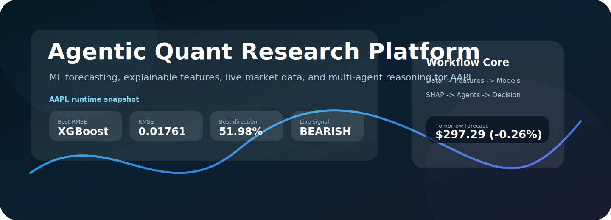
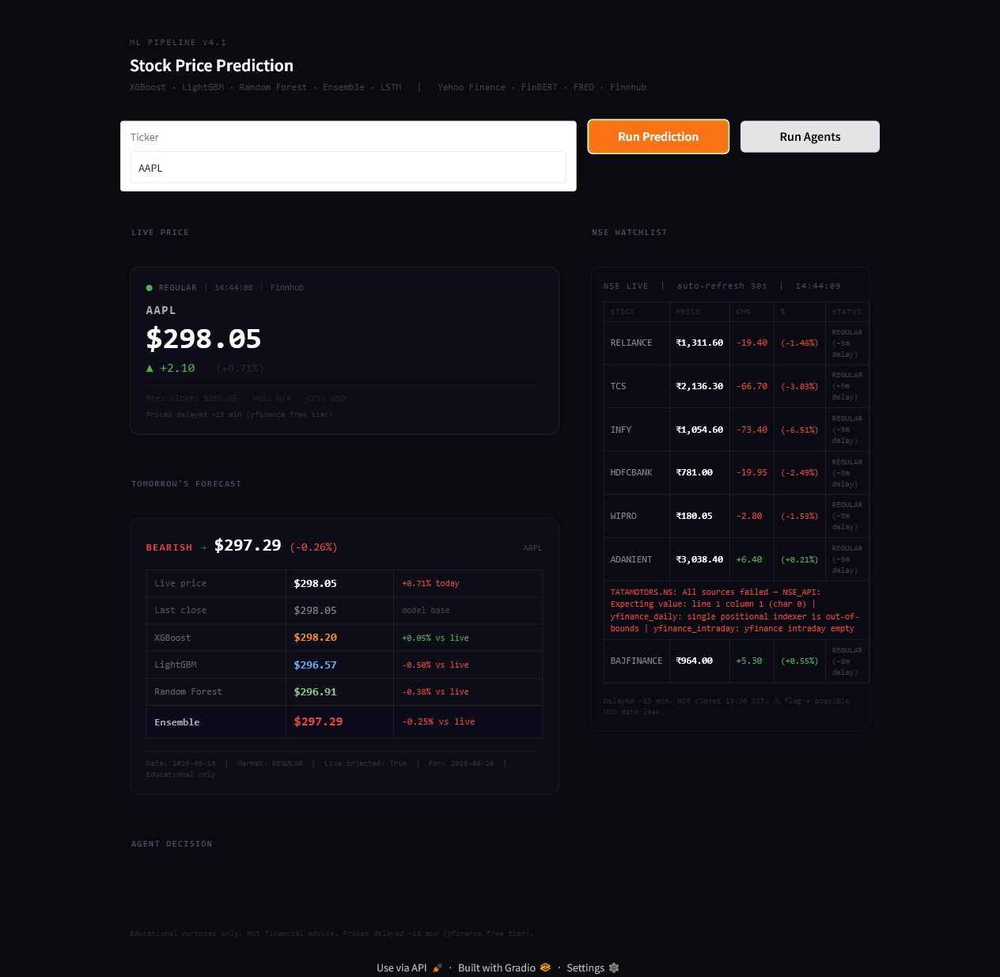
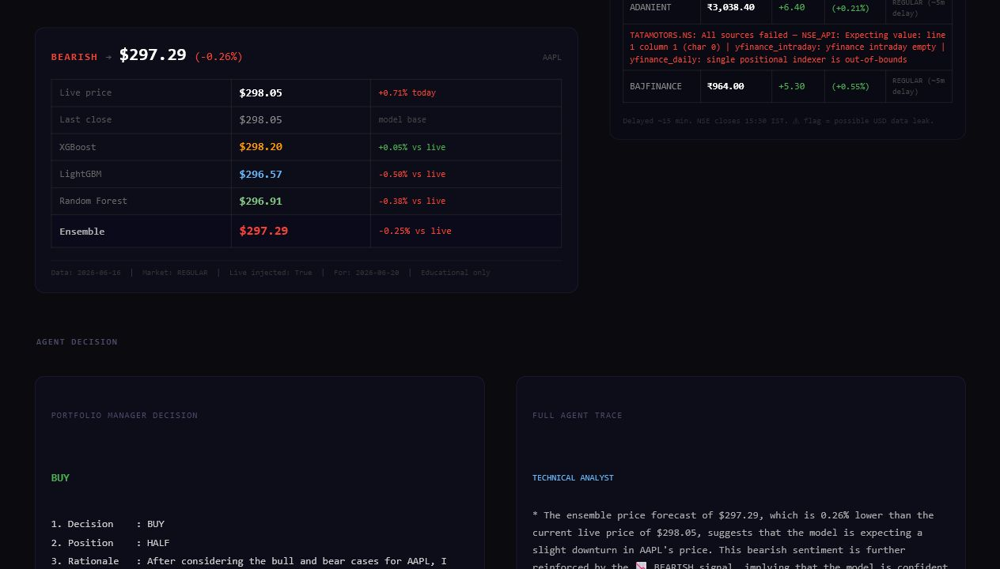
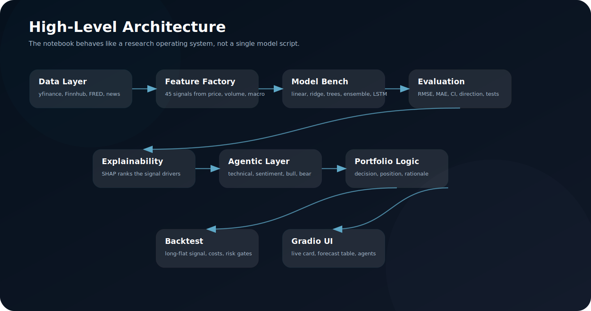
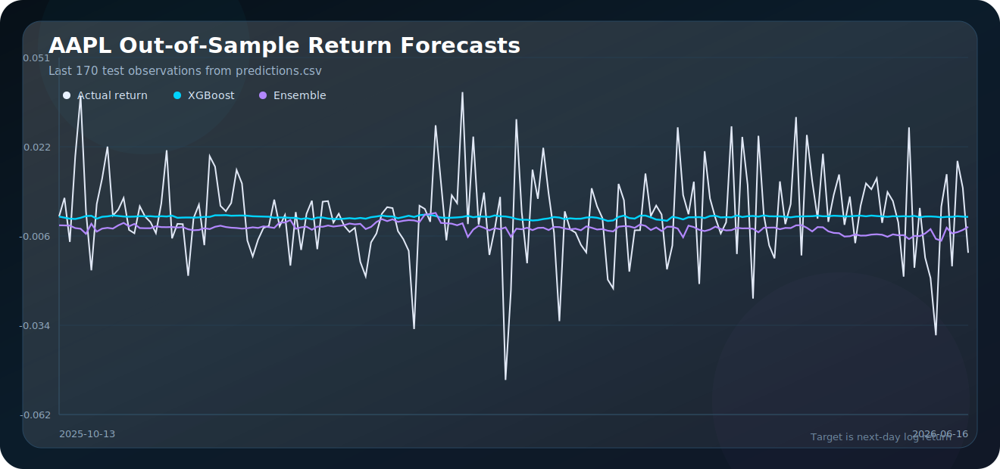
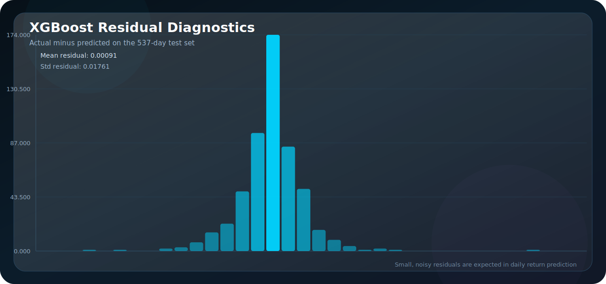
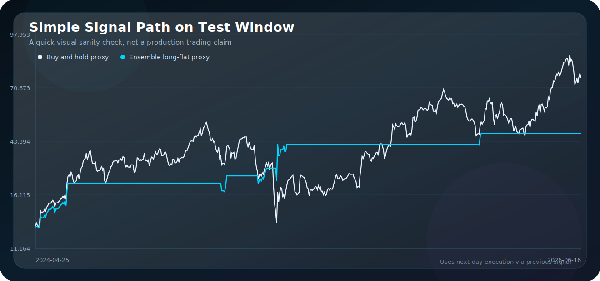
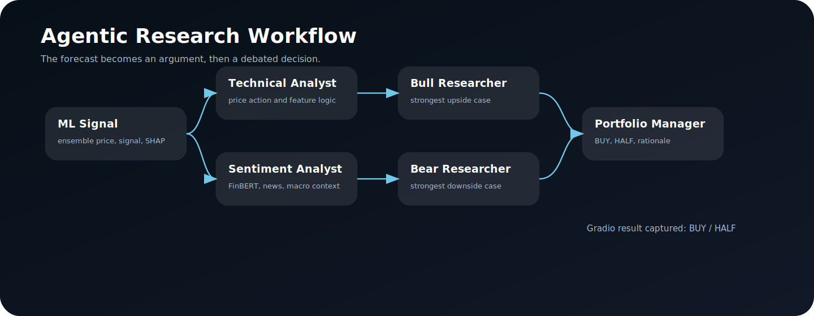

<div align="center">



<br>


</div>

## What This Project Is

This notebook is my attempt to build a small but serious market intelligence system around AAPL. It is not just "train a model and print a prediction." The pipeline collects market data, builds technical and macro features, trains multiple forecasting models, explains the model with SHAP, runs walk-forward validation, backtests a simple strategy, and then routes the result through an agentic AI research workflow.

The main idea is simple:

> a forecast is useful, but a forecast plus evidence, failure checks, explanation, sentiment, and debate is much more useful.

The project uses daily AAPL data from 2015-01-01 to 2026-06-19, then evaluates on an out-of-sample test window from 2024-04-25 to 2026-06-16. The target is next-day log return, which is a much harder and noisier target than predicting raw price levels.

> This is educational research code, not financial advice.

## Live Dashboard Snapshot

The deployed Gradio interface exposes the notebook as a usable product surface: ticker input, live price card, model forecast table, NSE watchlist, and agent decision trace.

| Forecast UI | Agent Decision |
|---|---|
|  |  |

For the captured AAPL run, the app showed:

| Field | Value |
|---|---:|
| Live price | $298.05 |
| XGBoost forecast | $298.20 |
| LightGBM forecast | $296.57 |
| Random Forest forecast | $296.91 |
| Ensemble forecast | $297.29 |
| Ensemble change vs live | -0.25% |
| Signal | Bearish |
| Live data injected | True |
| Prediction date | 2026-06-20 |

## High-Level Architecture



At a high level, the notebook behaves like a layered research system:

| Layer | What Happens |
|---|---|
| Data layer | Downloads AAPL OHLCV data, market context assets, live prices, news, and macro indicators. |
| Feature factory | Converts raw time series into technical, volume, volatility, lag, calendar, macro, and sentiment features. |
| Model bench | Trains linear models, tree ensembles, gradient boosting models, an ensemble, and LSTM. |
| Evaluation layer | Measures RMSE, MAE, R2, direction accuracy, confidence intervals, p-values, confusion matrices, and walk-forward results. |
| Explainability layer | Uses SHAP to rank the features driving the XGBoost model. |
| Agentic layer | Turns model output into structured technical, sentiment, bull, bear, and portfolio-manager reasoning. |
| Interface layer | Ships the workflow through a Gradio dashboard with live market refresh. |

## Low-Level Notebook Walkthrough

| Step | Notebook Component | Important Functions / Objects | What It Does |
|---:|---|---|---|
| 1 | Configuration | `CONFIG`, API keys | Sets ticker, date range, test size, folds, model settings, and optional API keys. |
| 2 | API diagnostics | Alpha Vantage, Finnhub, FRED checks | Verifies which external data sources are live before the pipeline depends on them. |
| 3 | Live price feed | `get_live_price`, `_fetch_finnhub`, `_fetch_nse`, `_fetch_yfinance_intraday`, `_fetch_yfinance_daily` | Tries multiple sources and falls back automatically when one source fails. |
| 4 | Historical data | `download_stock_data`, `add_market_context` | Pulls AAPL and market context tickers like SPY, QQQ, XLK, and VIX. |
| 5 | Data agent | `run_data_agent` | Adds news sentiment, analyst score, Fed Funds Rate, yield curve, FRED VIX, and CPI context. |
| 6 | Feature engineering | `engineer_features` | Builds 45 model-ready features and drops rows that are not usable after rolling windows. |
| 7 | Split and evaluation | `split_data`, `evaluate_model`, `plot_confusion_matrix` | Uses chronological train-test split and avoids random shuffling leakage. |
| 8 | Tuning | `xgb_objective`, `lgb_objective`, Optuna | Tunes XGBoost and LightGBM with time-series folds. |
| 9 | Model training | `train_eval` | Trains linear regression, ridge, XGBoost, LightGBM, random forest, ensemble, and LSTM. |
| 10 | Intraday update | `retrain_on_intraday` | Attempts to fine-tune with same-day 5-minute bars. In this run, it fell back because only 78 intraday rows were available and 200 were required. |
| 11 | Validation | `walk_forward_validation` | Re-trains across rolling windows to test stability through different regimes. |
| 12 | Explainability | `shap.TreeExplainer` | Produces SHAP bar and beeswarm plots for model interpretability. |
| 13 | Multi-step forecast | `multistep_forecast` | Tests whether error grows from T+1 to T+10. It does, which is expected. |
| 14 | Live inference | `predict_tomorrow` | Injects live price into a clean feature path and returns model-level price forecasts. |
| 15 | Agent graph | `TradingState`, `StateGraph`, `technical_analyst`, `sentiment_analyst`, `bull_researcher`, `bear_researcher`, `portfolio_manager` | Converts numbers into debate-style investment reasoning. |
| 16 | Backtest | `backtest_strategy` | Runs a simple long-flat strategy with transaction cost, stop-loss, and take-profit logic. |
| 17 | LLM report | `run_groq_agent` | Generates a concise research report from metrics, sentiment, prediction, and walk-forward data. |
| 18 | Gradio app | `gradio_predict`, `run_agents`, `refresh_live_ticker`, `refresh_indian_watchlist` | Exposes the project as an interactive dashboard. |
| 19 | Artifact export | CSV, JSON, PNG, model files | Saves predictions, metrics, tomorrow forecast, SHAP plots, model comparison, and trained models. |

## Feature Universe

The final training matrix contains 45 engineered features after rolling-window cleanup. I grouped them because reading one giant list is painful.

<details>
<summary><b>Full engineered feature list</b></summary>

| Group | Features |
|---|---|
| Market context | `SPY_Return`, `SPY_Lag1`, `QQQ_Return`, `QQQ_Lag1`, `XLK_Return`, `XLK_Lag1`, `VIX_Return`, `VIX_Lag1` |
| Trend | `SMA_20`, `SMA_50`, `SMA_200`, `EMA_12`, `EMA_26`, `Price_vs_SMA20`, `Price_vs_SMA50` |
| Momentum | `MACD`, `MACD_Signal`, `MACD_Hist`, `RSI_14`, `Stoch_K`, `Stoch_D` |
| Volatility | `BB_Upper`, `BB_Middle`, `BB_Lower`, `BB_Width`, `BB_Pct`, `ATR_14`, `Rolling_Std_20` |
| Return memory | `Daily_Return`, `Log_Return`, `Return_Lag_1`, `Return_Lag_2`, `Return_Lag_3`, `Return_Lag_5`, `Return_Lag_10`, `Rolling_Return_5`, `Rolling_Return_10`, `Rolling_Return_20` |
| Volume | `OBV`, `Volume_SMA_20`, `Volume_Ratio` |
| Calendar | `Day_of_Week`, `Month`, `Quarter` |
| Live feature | `Intraday_Return` |

</details>

The notebook also enriches the raw dataframe with `News_Sentiment`, `Analyst_Score`, `Fed_Funds_Rate`, `Yield_Curve`, `VIX_FRED`, and `CPI`. Those are part of the intelligence layer even when the final exported feature list focuses on the model-ready technical set.

## Experimental Setup

| Item | Value |
|---|---:|
| Ticker | AAPL |
| Historical start | 2015-01-01 |
| Notebook run date | 2026-06-19 |
| Downloaded daily rows | 2,882 |
| Feature rows after rolling windows | 2,681 |
| Train rows | 2,144 |
| Test rows | 537 |
| Test period | 2024-04-25 to 2026-06-16 |
| Target | Next-day log return |
| Best exported RMSE model | XGBoost |
| Best exported directional accuracy | LSTM |

The split is chronological. This matters because random train-test splits are usually too optimistic for time series. The model only trains on the past and evaluates on later observations.

## Model Results


| Model | RMSE | MAE | R2 | Direction Acc | P-Value | Significant |
|---|---:|---:|---:|---:|---:|---|
| XGBoost | 0.017614 | 0.011802 | -0.0053 | 50.09% | 0.7373 | No |
| Linear Regression | 0.017685 | 0.012100 | -0.0134 | 50.09% | 0.0051 | Yes |
| Ridge Regression | 0.017726 | 0.012110 | -0.0181 | 49.72% | 0.0042 | Yes |
| Ensemble | 0.017838 | 0.012340 | -0.0309 | 47.86% | 0.0000 | Yes |
| LightGBM | 0.018011 | 0.012520 | -0.0511 | 48.04% | 0.0000 | Yes |
| Random Forest | 0.019411 | 0.014211 | -0.2209 | 46.74% | 0.0000 | Yes |
| LSTM | 0.127247 | 0.106559 | -52.3907 | 51.98% | 0.0000 | Yes |

The important takeaway is not "the model cracked the market." It did not. The honest takeaway is more interesting:

1. XGBoost had the best exported RMSE at `0.017614`.
2. Linear and ridge regression were extremely close to XGBoost, which suggests the signal is weak and not magically unlocked by complexity.
3. LSTM had the highest directional accuracy, but its RMSE and R2 were terrible. I would not trust it for magnitude forecasting in this run.
4. MAPE is visually included in the runtime chart, but it is not a good primary metric here because the target is log return. Near-zero denominators can make MAPE explode.

## Forecast Diagnostics







Derived from `predictions.csv`:

| Diagnostic | Value |
|---|---:|
| Test observations | 537 |
| Actual mean daily log return | 0.001052 |
| Actual daily log return std | 0.017584 |
| XGBoost residual mean | 0.000912 |
| XGBoost residual std | 0.017607 |

The residual standard deviation being close to the actual return standard deviation is a useful reality check. The model is learning something around the edges, but daily equity returns are still very noisy.

## Walk-Forward and Horizon Tests

| Test | Result |
|---|---:|
| Walk-forward windows | 34 |
| Mean walk-forward RMSE | 0.017913 |
| Walk-forward RMSE std | 0.006854 |
| Mean walk-forward direction accuracy | 52.3% |
| Direction accuracy std | 7.3% |

Multi-step forecasting behaved like a time-series forecast usually behaves: the farther out the target, the more error accumulates.

| Horizon | RMSE |
|---:|---:|
| T+1 | 0.017615 |
| T+3 | 0.032943 |
| T+5 | 0.042769 |
| T+10 | 0.060719 |

## Explainability


The SHAP bar chart says the model leaned hardest on volume and technical structure:

| Rank | Feature | Interpretation |
|---:|---|---|
| 1 | `Volume_SMA_20` | Recent volume regime mattered most. |
| 2 | `OBV` | Directional volume pressure carried signal. |
| 3 | `BB_Lower` | Lower Bollinger band position helped describe price stress. |
| 4 | `EMA_12` | Short-horizon trend mattered more than slow trend alone. |
| 5 | `ATR_14` | Volatility regime was a useful input. |
| 6 | `Return_Lag_3` | Short memory in returns helped slightly. |
| 7 | `Rolling_Std_20` | Recent risk level mattered. |
| 8 | `Day_of_Week` | Calendar effects appeared in the learned structure. |

I like this result because it is not random-looking. It is not proof of causality, but it does line up with how a human would think about short-horizon market behavior: volume, volatility, trend, and recent returns.

## Agentic AI Workflow



The agent layer is built with LangGraph and a shared `TradingState`. The forecast is not treated as the final answer. It becomes evidence that different agents argue over.

| Agent | Input | Output |
|---|---|---|
| Technical analyst | Forecast table, signal, SHAP features | A technical interpretation of why the model is leaning bullish or bearish. |
| Sentiment analyst | FinBERT/news/macro sentiment | A sentiment summary and short-term market narrative. |
| Bull researcher | Technical and sentiment reports | Strongest upside argument. |
| Bear researcher | Technical and sentiment reports | Strongest downside argument. |
| Portfolio manager | Bull case, bear case, model signal | Final decision, position size, and rationale. |

The captured app run produced a slightly funny but useful result: the model forecast was bearish, but the portfolio-manager agent still returned `BUY` with `HALF` position sizing. That is actually a good example of why this layer exists. The agent is allowed to disagree with the raw model when it sees the signal as weak, noisy, or potentially contrarian.

I would not treat this as an autonomous trading system. I would treat it as a structured research assistant that forces the pipeline to explain itself from multiple angles.

## Backtest Result

The notebook includes a fixed, risk-managed backtest for the ensemble signal:

| Metric | Value |
|---|---:|
| Ensemble strategy return | +22.8% |
| Buy and hold return | +76.2% |
| Sharpe | 0.75 |
| Max drawdown | -9.9% |
| Win rate | 66.7% |
| Trades | 18 |
| Transaction cost | 0.1% |
| Stop-loss | 5% |
| Take-profit | 10% |

This is one of the most important honesty checks in the project. The model had useful-looking signals, but the simple strategy did not beat buy and hold on total return. That does not make the work useless. It means the research layer is doing its job: it exposes where predictive modeling and trade construction are not the same thing.

## Runtime Forecast Artifact

From `tomorrow_prediction.json`:

```json
{
  "ticker": "AAPL",
  "current_price": 298.05,
  "xgboost": 298.20,
  "lightgbm": 296.57,
  "random_forest": 296.91,
  "ensemble": 297.29,
  "pct_change": -0.255,
  "signal": "BEARISH",
  "prediction_date": "2026-06-20",
  "live_injected": true,
  "market_state": "REGULAR"
}
```

The live injection path is a strong engineering choice because it keeps the model from being purely static. The notebook also protects itself by not corrupting daily lag features with raw intraday rows.

## Main Findings

| Finding | What I Learned |
|---|---|
| Daily return forecasting is hard | Even the best models sit close to coin-flip direction accuracy. |
| XGBoost was the best magnitude model | It gave the best RMSE, but only narrowly beat simpler baselines. |
| LSTM was not robust here | Highest direction accuracy did not compensate for very poor RMSE and R2. |
| SHAP made the system more trustworthy | Volume, volatility, and trend features dominated instead of random columns. |
| Backtesting changed the story | A decent forecast did not automatically become a superior strategy. |
| Agentic reasoning added structure | The system could debate weak, conflicting evidence instead of blindly obeying the model. |
| Fallback logic mattered | Finnhub, NSE, yfinance, and daily fallbacks kept the live app usable under API issues. |

## Why These Design Choices Make Sense

This project is influenced by a few ideas from market efficiency, empirical asset pricing, and machine learning:

1. Fama's efficient market hypothesis says price prediction should be difficult if information is already reflected in prices. The near-coin-flip directional accuracy here is consistent with that warning.
2. Lo and MacKinlay showed that returns are not always pure random walks, which motivates looking for weak statistical structure without assuming it will be large.
3. Gu, Kelly, and Xiu showed that ML can help in empirical asset pricing, especially with nonlinear interactions. That supports testing tree models and neural networks instead of only linear baselines.
4. Bailey, Borwein, Lopez de Prado, and Zhu warned about backtest overfitting. That is why the README reports the backtest result even though it is not flattering.
5. SHAP is included because a model that cannot explain itself is not very satisfying in finance, where false confidence is expensive.

## How To Run

```bash
pip install yfinance ta xgboost lightgbm optuna shap tensorflow gradio \
  feedparser fredapi beautifulsoup4 transformers torch groq langgraph langchain-groq
```

Optional API keys improve the live system but are not all required for the core price pipeline:

| Key | Used For |
|---|---|
| `FINNHUB_API_KEY` | Live US quote and company news |
| `FRED_API_KEY` | Macro features |
| `ALPHAVANTAGE_API_KEY` | Alternative news feed |
| `GROQ_API_KEY` | LLM report and agent reasoning |

Expected artifacts after a full run:

| Artifact | Purpose |
|---|---|
| `predictions.csv` | Out-of-sample actual vs model predictions |
| `metrics.json` | Model benchmark table |
| `tomorrow_prediction.json` | Live inference result |
| `analysis_report.txt` | LLM-generated research summary |
| `model_comparison.png` | Runtime model comparison chart |
| `shap_summary.png` | SHAP feature importance |
| Model files | XGBoost, LightGBM, Random Forest, and LSTM exports |

## Limitations

This is the part I would rather be honest about than hide:

1. The target is next-day return, which is extremely noisy.
2. The model metrics are useful for research, not enough for deployment as a trading strategy.
3. MAPE is not reliable for near-zero log-return targets.
4. The intraday fine-tune failed in the captured run because there were only 78 intraday rows, below the 200-row feature requirement.
5. The NSE watchlist exposed a real data-source failure for `TATAMOTORS.NS`, which is good to log but should be cleaned up in production.
6. The LLM agent can produce convincing prose even when the statistical evidence is weak, so it should be treated as a reasoning layer, not a truth engine.
7. The backtest is intentionally simple and should not be read as an institutional execution simulation.

## Research References

1. Eugene F. Fama, [Efficient Capital Markets: A Review of Theory and Empirical Work](https://www.jstor.org/stable/2325486), Journal of Finance, 1970.
2. Andrew W. Lo and A. Craig MacKinlay, [Stock Market Prices Do Not Follow Random Walks](https://academic.oup.com/rfs/article-abstract/1/1/41/1601244), Review of Financial Studies, 1988.
3. Shihao Gu, Bryan Kelly, and Dacheng Xiu, [Empirical Asset Pricing via Machine Learning](https://academic.oup.com/rfs/article/33/5/2223/5758276), Review of Financial Studies, 2020.
4. Tianqi Chen and Carlos Guestrin, [XGBoost: A Scalable Tree Boosting System](https://dl.acm.org/doi/10.1145/2939672.2939785), KDD, 2016.
5. Guolin Ke et al., [LightGBM: A Highly Efficient Gradient Boosting Decision Tree](https://papers.nips.cc/paper/6907-lightgbm-a-highly-efficient-gradient-boosting-decision-tree), NeurIPS, 2017.
6. Sepp Hochreiter and Jurgen Schmidhuber, [Long Short-Term Memory](https://direct.mit.edu/neco/article/9/8/1735/6109/Long-Short-Term-Memory), Neural Computation, 1997.
7. Scott Lundberg and Su-In Lee, [A Unified Approach to Interpreting Model Predictions](https://arxiv.org/abs/1705.07874), NeurIPS, 2017.
8. Dogu Araci, [FinBERT: Financial Sentiment Analysis with Pre-trained Language Models](https://arxiv.org/abs/1908.10063), arXiv, 2019.
9. David H. Bailey, Jonathan M. Borwein, Marcos Lopez de Prado, and Qiji Jim Zhu, [The Probability of Backtest Overfitting](https://papers.ssrn.com/sol3/papers.cfm?abstract_id=2326253), SSRN, 2013.

## Final Note

The strongest part of this project is not that it predicts tomorrow perfectly. It does not. The strongest part is that the whole workflow is inspectable: data, features, models, validation, explainability, agents, UI, and exported artifacts all connect into one research loop.

That is the part I am most proud of.
